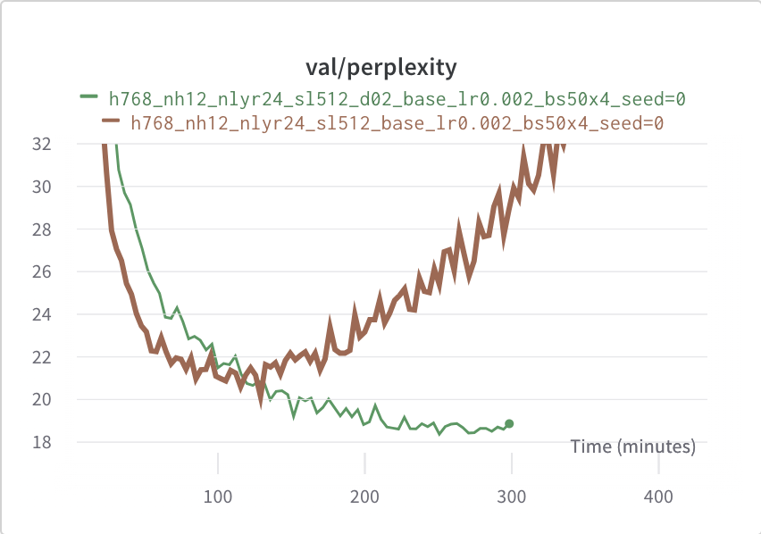

# LLM-baselines

A modular codebase to experiment with transformers, inspired from NanoGPT. 

## Quickstart 

Install dependencies: 

```
pip install -r requirements.txt
```

Run a simple training on the Wikitext dataset:

```
python ./src/main.py
```

The above command trains a 213.34M parameters model (see the "Results on wikitext" section for more details). The training takes a bit less than 5h on one 40GB A100. It trains for 15k iterations with a batch size of 50x4 (4 gradient accumulation steps), hence a speed of 0.84 iteration per second, or 86k tokens per second. You should reach a perplexity of around 18.5. 

If you don't have so much VRAM:

```
python ./src/main.py --n_layer 12 --sequence_length 256
```

If you have **very** limited resources, try the shakespeare dataset and character-based tokenizer:

```
python ./src/main.py --n_layer=2 --n_head=4 --n_embd=128 --sequence_length=256 --dataset=shakespeare-char --device=cpu --vocab_size=96
```

## Less quick start

Here are the possible parameters you can use (copypasta from `config/base.py`):

```python
    # General training params
    parser.add_argument('--batch_size', default=50, type=int)
    parser.add_argument('--acc_steps', default=4, type=int)
    parser.add_argument('--seed', default=0, type=int)
    parser.add_argument('--device', default='cuda:0', type=str)
    parser.add_argument('--iterations', default=15000, type=int)
    parser.add_argument('--lr', default=2e-3, type=float)
    parser.add_argument('--warmup_percent', default=0.02, type=float)
    parser.add_argument('--weight_decay', default=1e-3, type=float)
    parser.add_argument('--beta1', default=0.9, type=float)
    parser.add_argument('--beta2', default=0.95, type=float)
    parser.add_argument('--scheduler', default='cos', choices=['linear', 'cos', 'none'])
    parser.add_argument('--opt', default='adamw', choices=['adamw', 'sgd'])
    parser.add_argument('--eval_freq', default=200, type=int) # in iterations
    parser.add_argument('--results_base_folder', default="./exps", type=str) 
    # Dataset params
    parser.add_argument('--dataset', default='wikitext', choices=['wikitext', "shakespeare-char", 'arxiv', "arxiv2000", "arxiv+wiki", 'openwebtext2'])
    parser.add_argument('--vocab_size', default=50304, type=int)
    parser.add_argument('--data_in_ram', action='store_true') # force the data to RAM, mostly useless except for openwebtext2 
    # Model params
    parser.add_argument('--model', default='base', choices=['base', 'sparse-heads-q'])
    parser.add_argument('--use_pretrained', default="none", type=str) # 'none', 'gpt-2' or a path to the pretraind model
    parser.add_argument('--dropout', default=0.2, type=float)
    parser.add_argument('--n_head', default=12, type=int)
    parser.add_argument('--n_layer', default=24, type=int) # depths in att + ff blocks
    parser.add_argument('--n_embd', default=768, type=int) # embedding size / hidden size ... 
    parser.add_argument('--sequence_length', default=512, type=int)
    parser.add_argument('--dtype', default=torch.bfloat16, type=torch.dtype)
    parser.add_argument('--bias', default=False, type=bool)
    parser.add_argument('--no_compile', action='store_true') # if true then model is not compiled 
    # logging params (WandB)
    parser.add_argument('--wandb', action='store_true') # whether to use wandb or not
    parser.add_argument('--wandb_project', default="my-project", type=str)
    parser.add_argument('--wandb_run_prefix', default="none", type=str) # is added before the autogenerated experiment name
    parser.add_argument('--eval_seq_prefix', default="The history of Switzerland ", type=str) # prefix used to generate sequences
    # Distributed args
    parser.add_argument('--distributed_backend', default=None, type=str, required=False,
                        choices=distributed.registered_backends())  # distributed backend type
```

## Using WAndB

You need to give your wandb authorize key in order to send the data to your wandb account. If you start jobs on a server without access to prompt, then you can set the `WANDB_API_KEY` variable within your script:

```bash
# this is a script that could be executed on a server
pip install -r requirements.txt # install req.
export WANDB_API_KEY="put your authorize key here, to find it: https://wandb.ai/authorize"
python ./src/main.py --wandb --wandb_project "my awesome project" --n_layer 7 --model base --seed 123
```

## How to add your own transformer architecture? 

The structure of the project is the following: 

```sh
src/
    main.py         # pick the right data, model, and training function
    config/
        __init__.py # contains CONFIG_FORMAT_TO_MODULE_MAP mapping the name given to the --config_format flag with a python conf file
        base.py     # config for the base model
        sparse.py   # config for some sparsehq model
    data/
        utils.py    # contains the get_dataset function
        wikitext.py # load/process wikitext
        arxiv.py    # load/process arxiv
        shakespeare.py # load/process the Shakespeare dataset
    models/
        utils.py    # contains the get_model function
        base.py     # contains the standard transformer base architecture
        sparsehq.py # a fork of base.py with a different architecture
    optim/
        utils.py    # contains eval and get_batch functions
        base.py     # training function for the base model
        sparse.py   # training function for the sparsehq model
    distributed/
        # code to enable simple distributed training
```

Given the above structure, to add your own model, you can just fork the `./src/models/base.py` file, do your modifications, then if necessary fork the `./src/optim/base.py` in case you need some custom training loop or evaluation. You also need to fork the `./src/config/base.py` file to add your own parameters, which imply adding your new config to the mapping `CONFIG_FORMAT_TO_MODULE_MAP` in `./src/config/__init__.py`. To add a new dataset, create a new file in the `data` folder, check `wikitext.py` for the expected format. 


## Results on wikitext

Trying to get the best perplexity as fast as possible, I settled for using a model (213.34M parameters) with the following parameters:
* n_embd: 768
* n_head: 12
* dropout: 0.2 (0.1 also works fine)
* n_layer: 24
* sequence_length: 512
* batch_size: 50
* acc_steps: 4
* iterations: 15000
* lr: 0.002
* warmup_percent: 0.02

The training reaches convergence after a bit less than 5 hours (on one 40GB A100), with a perplexity around 18.5, which I believe to be good for a non-pretrained model. The figure below shows the evolution of perplexity for two models with and without dropout, showing the importance of dropout. It should be possiblee to reach similar perplexity without dropout with a smaller batch size but this would probably extend the duration of the training. 



A lighter and faster (12 layers instead of 24) but still very good config on wikitext:

* n_embd: 768
* n_head: 12 
* n_layer: 12 
* batch_size: 55 
* sequence_length: 512 
* acc_steps: 3 
* dropout: 0.2
* iterations: 15000
* lr: 0.002
* warmup_percent: 0.02
